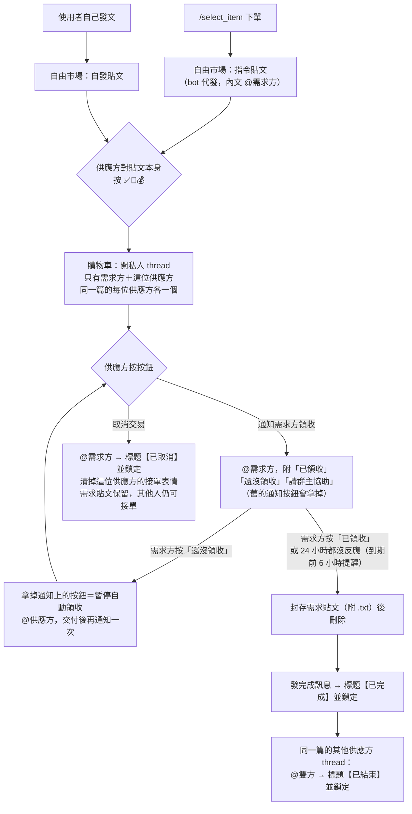
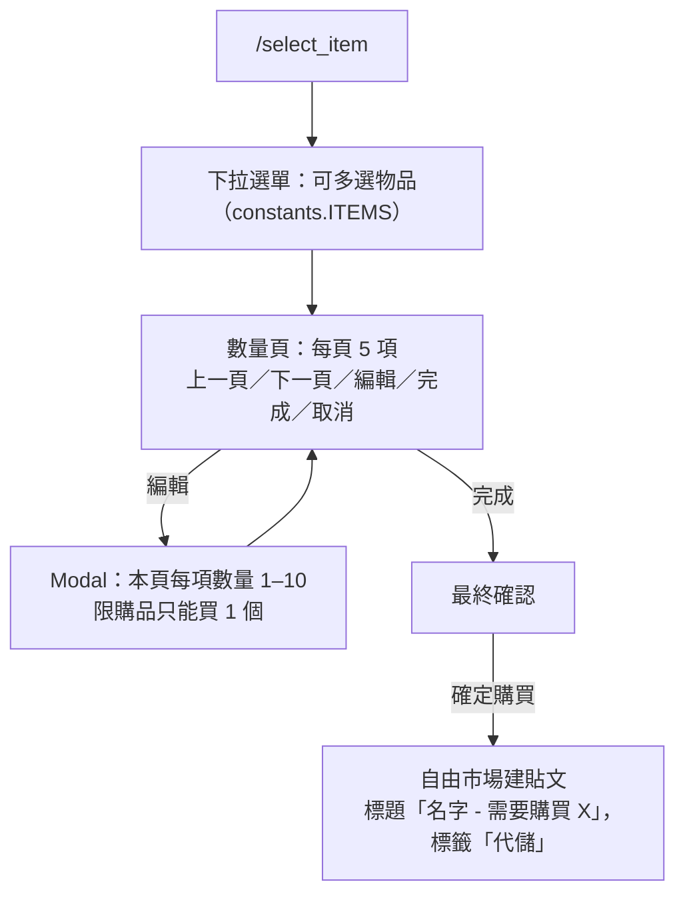
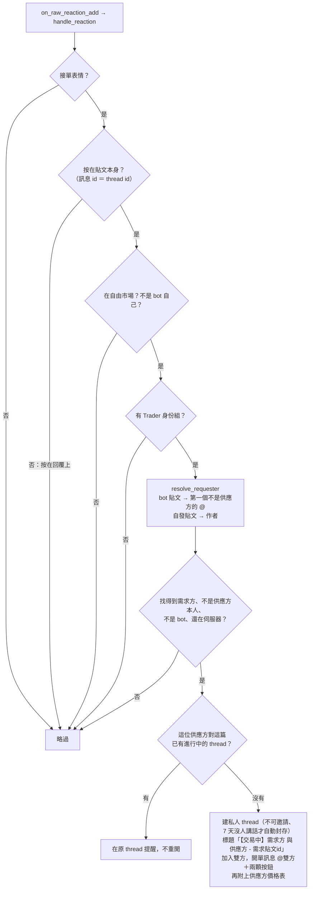
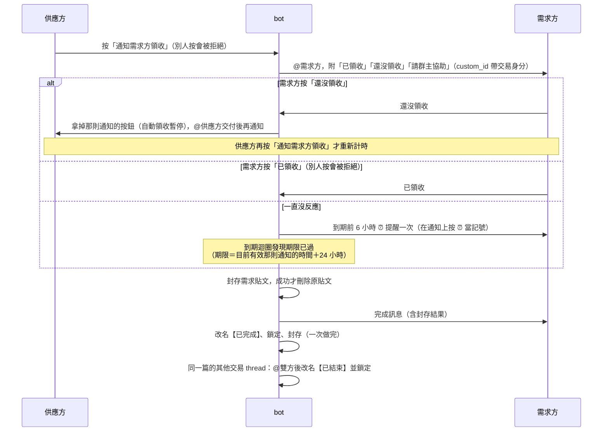
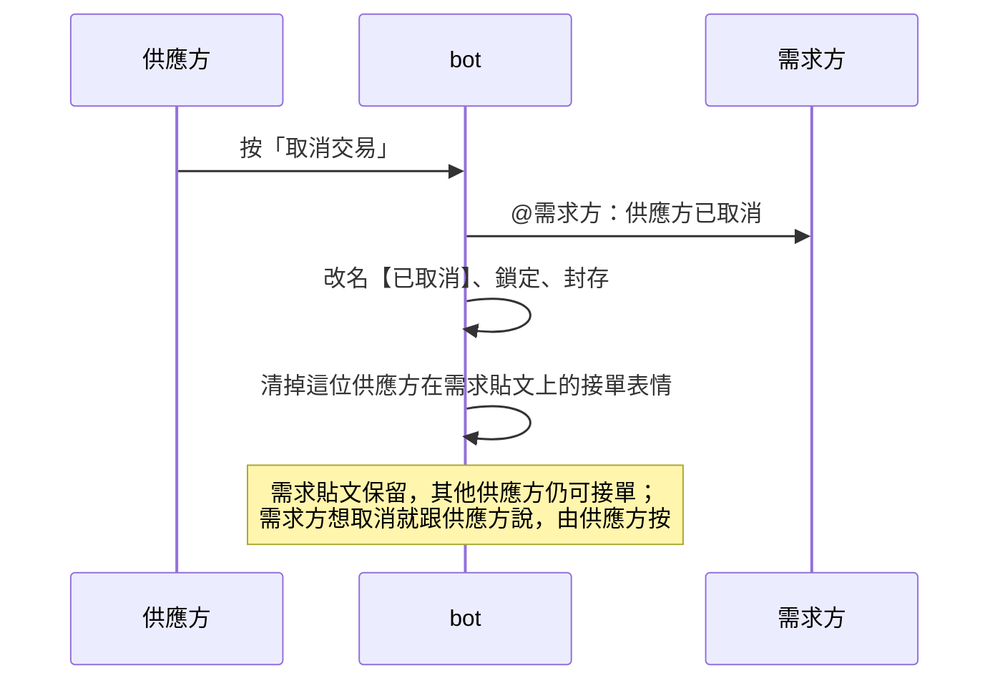
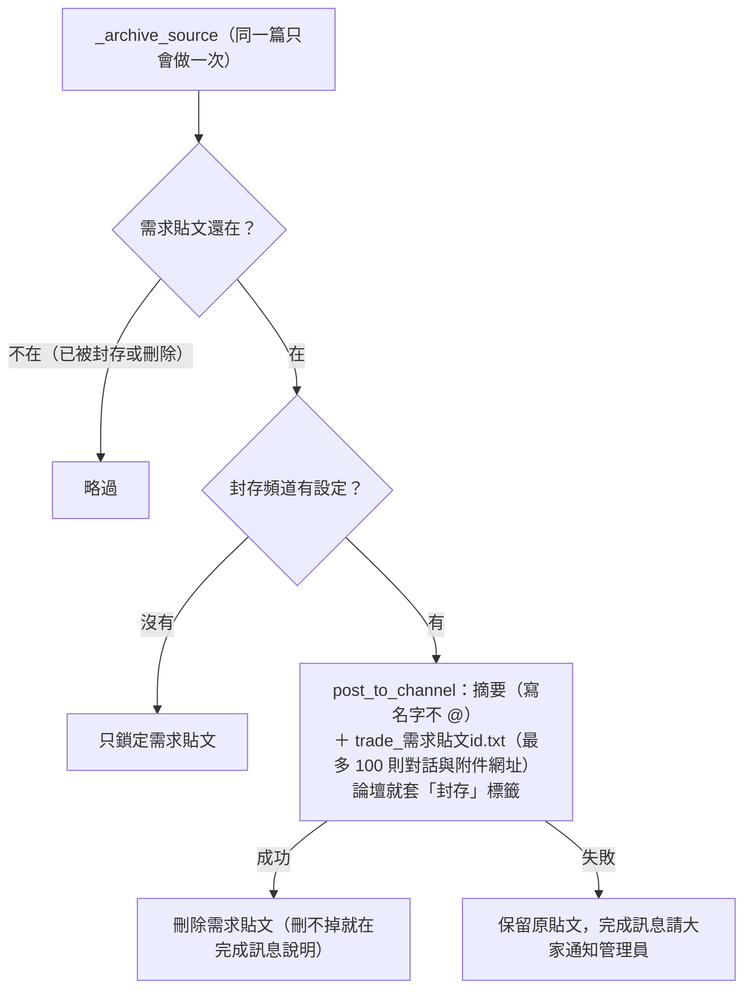
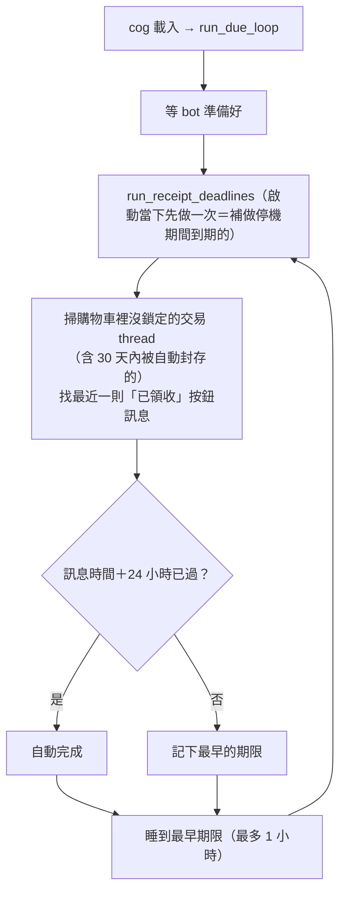
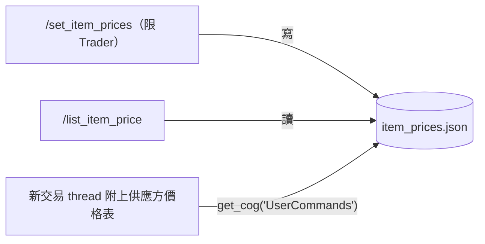

# 交易流程

> 2026-10-03 02:28 重啟上線（啟動檢查 828 項全過）。改版的決定與理由記在 `AI_HANDOFF_AND_TODO.md` 的「交易功能改版」區塊；商品上架還在討論，見同一區塊。

行號會隨改動漂移，請以函式名稱為準。圖是 Mermaid，GitLab 會直接顯示；VS Code 要裝 `bierner.markdown-mermaid` 擴充，預覽裡才看得到圖。

## 用語

交易不一定是買賣，所以不叫買家、賣家（使用者 2026-10-03 定名）。

| 用語 | 意思 | 程式裡的名字 |
|---|---|---|
| 自由市場 | 交易論壇頻道 | `trade_forum_channel_id` |
| 需求貼文 | 自由市場裡的一篇貼文，也就是交易的來源。分成**指令貼文**（`/select_item` 由 bot 代發，內文 @ 需求方）和**自發貼文**（使用者自己發） | `source`、`source_id` |
| 需求方 | 自發貼文的作者；指令貼文則是內文被 @ 的人 | `requester` |
| 供應方 | 對需求貼文按接單表情的人，必須有 Trader 身份組（伺服器上叫觀星者） | `supplier` |
| 接單 | 供應方對需求貼文**本身**按 ✅、🤝 或 💰 | `TradeService.handle_reaction` |
| 交易 thread | 購物車頻道底下的私人 thread，**每位供應方各一個**，只有需求方和該供應方 | `TradeService.open_trade` |
| 交易身分 | 需求貼文 id、需求方 id、供應方 id，寫在按鈕的 custom_id | `TradeRef` |
| 領收 | 供應方按「通知需求方領收」，需求方按「已領收」。還沒收到可以按「還沒領收」暫停；24 小時都沒反應才自動完成，到期前 6 小時會 @ 需求方提醒一次 | `request_receipt`、`hold_receipt`、`complete` |
| 請群主協助 | 有爭議時雙方都能按，bot 把群主（伺服器擁有者）加進交易 thread 並 @ 他 | `call_owner` |
| 封存 | 需求貼文的對話複製到封存頻道（完整內容附 .txt），成功後刪除原貼文 | `_archive_source` |

## 頻道與設定

| 設定鍵（`src/config.json`） | 頻道 | 類型 | 用途 |
|---|---|---|---|
| `trade_forum_channel_id` | 自由市場 | 論壇 | 需求貼文；可用標籤有帳號、道具、金幣、代練、代儲 |
| `cart_delivery_channel_id` | 🛒購物車 | 文字頻道 | 交易 thread |
| `archive_channel_id` | 封存 | 論壇（文字頻道也可以） | 已完成交易的需求貼文副本，標籤是「封存」 |
| `role_mapping.Trader` | 觀星者 | 身份組 | 可以接單（供應方）、設定價格 |

三個頻道都在 `src/settings/channel_registry.py` 登記，由 `/server_manager` 的「頻道設定」綁定，交易模組每次用到都重讀（有 5 分鐘快取）。其餘設定在 `src/sys_settings/trade_settings.py` 的 `TradeSettings`：接單表情、供應方身份組、領收期限（24 小時）、期限檢查的最長間隔（1 小時）、封存最多複製幾則（100 則）。

## 程式碼清單

| 檔案 | 內容 |
|---|---|
| `src/services/community/trade_service.py` | **交易模組**。`TradeService`：`handle_reaction`（接單入口）、`open_trade`、`handle_button`（按鈕入口）、`request_receipt`、`cancel`、`complete`、`run_receipt_deadlines`（領收期限）。另有 `resolve_requester`（判定需求方，全模組只在這裡判斷）、`TradeRef`（交易身分與 custom_id）、標題前綴、舊格式解析 `legacy_ref_from_text` |
| `src/commands/forum_monitor.py` | Discord 介面（cog `ForumMonitor`）：表情監聽交給交易模組、`TradeButton`（DynamicItem，重啟後仍可按）、`LegacyTransactionView`（舊按鈕）、新 thread 附上供應方價格表、啟動領收期限的定時檢查。檔名沿用（09-29 決定不改名） |
| `src/utils/due_loop.py` | `run_due_loop`：到期迴圈（睡到下一個時刻、啟動時補做、出錯不中斷），共用元件 |
| `src/sys_settings/trade_settings.py` | `TradeSettings` |
| `src/commands/trade_commands.py` | `/select_item`（下單、在自由市場發指令貼文）、`/set_item_prices`、`/trade_info`；與交易 thread 無關 |
| `src/commands/user_commands.py` | `get_user_item_prices`、`/list_item_price`（價格表）；關鍵字監看對自由市場的 bot 貼文例外放行 |
| `src/constants.py` `ITEMS`、`src/static/items.png`、`settings/item_prices.json` | 固定物品清單、物品圖、每位供應方的價格 |
| `src/test/test_trade_flow.py`、`src/test/test_due_loop.py` | 交易流程與到期迴圈的測試 |

## 流程圖

### 1. 總覽

### 2. `/select_item`：發指令貼文（這次沒改）

### 3. 接單

### 4. 領收

### 5. 取消（只有供應方能按）

### 6. 封存需求貼文

### 7. 領收期限（到期迴圈）

### 8. 價格表（這次沒改）

## 交易資料存在哪裡

沒有資料表，紀錄就是 Discord 本身（TR-Q1）。

**坑：discord.py 的 thread 快取只有活躍的。** thread 一封存（沒人講話一段時間就自動封存：購物車頻道預設 3 天、自由市場 1 小時）就被移出快取，`TextChannel.threads` 看不到。所以找交易 thread 時，除了快取還會往回翻「已封存的私人 thread」（`_open_trade_threads`，需要 Manage Threads 權限）：找同一篇需求時翻到需求貼文建立時間為止，檢查領收期限時翻 30 天。新開的交易 thread 也指定 7 天才自動封存。取消時要清需求貼文上的表情，而對封存中的 thread 改反應會被拒絕，所以會先解除封存。

| 資料 | 存在哪 | 怎麼讀回來 |
|---|---|---|
| 交易身分（需求貼文、需求方、供應方） | 按鈕 custom_id：`trade:動作:需求貼文id:需求方id:供應方id`；只有 bot 寫得進去 | 按下時由 `TradeButton`（DynamicItem）解析；找交易 thread 時讀開單訊息的按鈕 |
| 進行中或已結束 | 交易 thread 是否鎖定；標題前綴【交易中】→【已完成】【已取消】【已結束】，只在結束時改一次名 | `thread.locked` |
| 同一篇需求有哪些交易 | 交易 thread 標題結尾的需求貼文 id | 掃購物車的 thread |
| 領收期限 | 目前有效的那則通知（還帶著「已領收」按鈕）的時間＋24 小時；按「還沒領收」或發新通知，舊通知的按鈕會拿掉，期限跟著消失 | 到期迴圈掃 thread 歷史 |
| 提醒過沒有 | bot 有沒有在那則通知上按 ⏰ | 到期迴圈看通知上的表情 |
| 名字 | 一律用伺服器暱稱：先查成員快取，沒有再向 Discord API 查（沿用 2025-07 `b456d91`，當時只看快取讓接單失敗）。thread 標題、封存摘要、封存附檔的對話者都一樣 | `TradeService._member`、`_display_names` |
| 完成紀錄 | 封存頻道的副本（摘要＋.txt）；交易 thread 鎖定後留在購物車 | 人看 |
| 供應方價格 | `item_prices.json` | `get_user_item_prices` |

## 改版前的交易 thread（相容）

- 舊開單訊息是一段文字（「使用者 @供應方 對交易貼文…貼文者為 @需求方…來源貼文 ID: N」），舊按鈕的 custom_id 是 `forum_trade_confirm`、`forum_trade_cancel`。
- `LegacyTransactionView` 接住舊按鈕，用 `legacy_ref_from_text` 讀回交易身分，交給同一個交易模組：舊的「買家領收」等同新的「通知需求方領收」，會發出新的「已領收」按鈕。
- 舊標題「交易確認 - 需求方 和 供應方 - 需求貼文id」也算交易 thread：同一位供應方不會再重開，一篇完成時也會一起結束。
- 改版前用 ✅ 表情等待領收，那是記憶體裡的等待，重啟就沒了。重啟後供應方再按一次舊的「買家領收」即可接上新流程。
- 舊 thread 都結束後，可以刪掉 `LegacyTransactionView` 和 `legacy_ref_from_text`。

## 建置歷程（從 git log 整理）

交易功能在這次改版前沒有寫進交接文件或歸檔文件。

| 日期 | commit | 改了什麼 |
|---|---|---|
| 2025-06-22 | `3931cd2` | 偵測販賣者在自由市場按表情 |
| 2025-06-22 | `66261ee` | 開交易 thread。「作者必須是 bot、買家從 @ 抓」和「標題結尾放來源貼文 ID，用標題防止重複開單」都是從這裡開始的 |
| 2025-06-22 | `44ac681` | 完成時鎖定並封存交易 thread 與來源貼文；24 小時沒確認改成自動領收 |
| 2025-06-22 | `4f76f0f` | 完成時改成先把來源貼文複製到封存頻道，再刪除來源貼文 |
| 2025-06-23 | `fb99004`、`93ae28b`、`6eb46d0` | 賣家改用按鈕確認（`TransactionView`）；新增取消交易；防重複開單時排除已鎖定或已封存的 thread |
| 2025-06-26～27 | `9e4b336`、`3828872` | 身份組權限（Trader）；物品價格的設定與查詢 |
| 2025-07-01 | `eb71632`、`e8741cc` | `/select_item` 改成可多選；開交易 thread 時附上賣家價格表 |
| 2025-07-25 | `b456d91` | 修正取得成員失敗的問題（暫時加上多層回退） |
| 2025-08-11 | `bbdbffd` | 商城禮包不再限購 1 個 |
| 2026-02-17～21 | `ec81659`、`f4bbe64`、`ce401be` | 強化互動回應並加上結構化 log；`ce401be` 讓按鈕重啟後仍可用，並加上救援 view |
| 2026-09-29 | `06fa02d`、`97d7595` | 只改了 log 和 import 路徑 |
| 2026-10-03 | （未 commit） | 改版：交易模組、需求方／供應方、自發貼文接單、每位供應方各一個 thread、領收按鈕與到期迴圈、Discord 當紀錄 |

改版前，交易 thread 標題結尾的來源貼文 ID 從 `66261ee` 就有了，一直只用來防止重複開單，從沒用它還原交易資料，也沒在標題上標過狀態。

## 改版前的缺口與處理（2026-10-03 核對）

| # | 改版前 | 現在 |
|---|---|---|
| 1 | 自發貼文不會觸發：作者不是 bot 就略過，領收時也會擋。實例：「需要購買2000個PY幣」（`1466085282771239230`） | 已修：需求方由 `resolve_requester` 一處判定 |
| 2 | 領收等待只存在記憶體，重啟後按 ✅ 沒反應（沒有實際發生過） | 已修：改成「已領收」按鈕，期限從訊息時間推算，到期迴圈重啟後照樣補做 |
| 3 | 完成或取消後交易 thread 被重新打開（先鎖定封存才發訊息）。實例：`1555439660975788063` | 已修：先發訊息，再一次改名、鎖定、封存 |
| 4 | 沒人收尾的交易一直掛著（3 筆） | 未處理（TR-Q5）：之後和預購到期提醒一起做 |
| 5 | 只有賣家能按「買家領收」和「取消交易」 | 維持（TR-Q4）：只有供應方能取消，避免需求方受領服務後擅自取消 |
| 6 | 封存把對話塞進一則訊息，超過 2000 字會失敗；不含附件 | 已修：完整對話附 .txt（含附件網址），仍最多 100 則；交易 thread 本身不複製 |
| 7 | 沒有任何測試 | 已補：`test_trade_flow.py` 31 項、`test_due_loop.py` 3 項；44 種突變全紅 |
| 9 | 24 小時自動領收對需求方太霸道：供應方沒給東西也會被視為已領收 | 已修（TR-Q18、Q19）：「還沒領收」暫停、到期前提醒、「請群主協助」 |
| 8 | 第二位供應方接同一篇時，通知被塞進第一位的 thread，他本人看不到 | 已修：每位供應方各一個 thread |

## 改動時的牽動點

- 兩個 `on_raw_reaction_add` 監聽都會觸發：`discord_bot.py` 統計表情、`forum_monitor.py` 接單。
- 共用元件 `post_to_channel` 不支援 `view=`，之後商品上架要發帶按鈕的貼文，就得擴充它。
- 關鍵字監看（`user_commands.py`）只對自由市場放行 bot 貼文；新的論壇如果也由 bot 代發，那裡要一起改。
- 身份組類型選單寫死 Trader 和 Moderator（`management_commands.py`）。
- 新增 cog 要加進 `COMMAND_MODULES`；啟動 gate 的 `test_import_resolution.py` 會檢查。
- 之後的商品購買要開交易 thread，直接呼叫 `TradeService.open_trade`，不要另寫一份。
